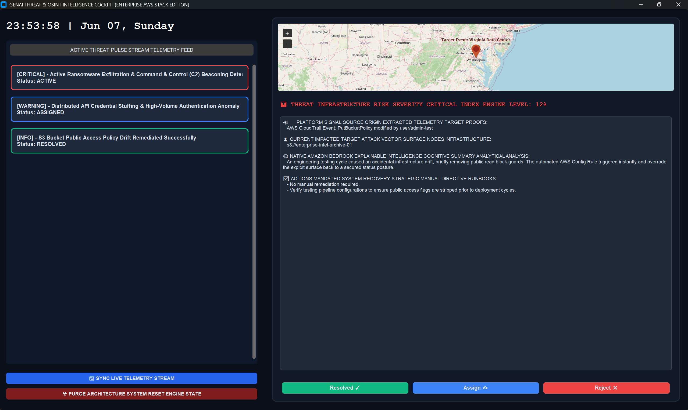
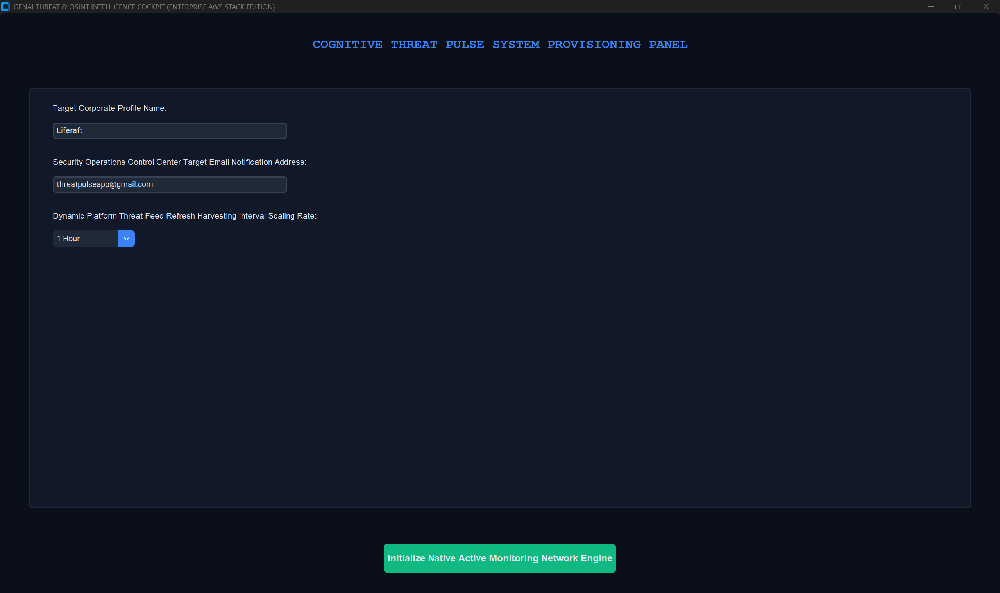
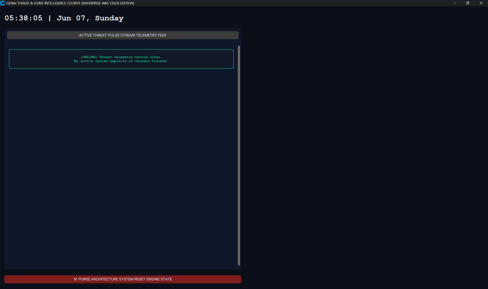
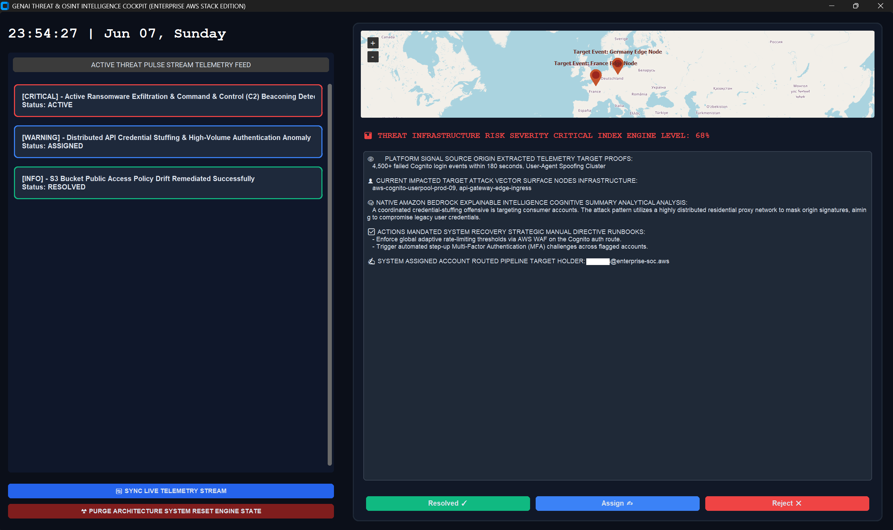
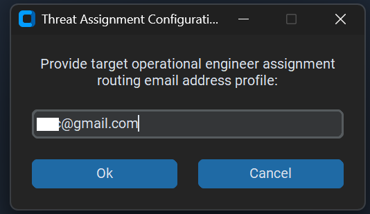

# 📡 Project 4: ThreatPulse: Autonomous Multi-Agent AWS Threat Intelligence Cockpit

An advanced, production-grade autonomous threat intelligence and security orchestration platform designed to revolutionize cloud incident forensics and real-time perimeter defense. **ThreatPulse** orchestrates a high-performance dual-engine framework: an active multi-agent stream parser that continuously harvests security telemetry from multi-layer AWS environments (AWS CloudTrail, AWS Cognito, and AWS Config Rules), and a generative analysis pipeline powered by **Amazon Bedrock** to deliver explainable, contextual threat summaries.

Built natively using **Python**, **CustomTkinter**, **TkinterMapView**, and secure **SOAR communication protocols**, ThreatPulse eliminates raw security log fatigue—instantly transforming unstructured JSON anomalies into high-fidelity geographical data arrays, risk scores, and tactical remediation playbooks.

---

## 📸 Screenshots

### Application Preview


---

## ⚡ Core Features

* **Multi-Agent Ingestion Pipeline:** Continuously ingests and processes live or seeded event logs from distributed enterprise perimeters to identify active infrastructure vulnerabilities and exfiltration footprints.
* **Explainable GenAI Security Forensics:** Integrates natively with Amazon Bedrock foundation models to instantly isolate blast radiuses, evaluate adversary intent (e.g., BlackCat/ALPHV ransomware profiles), and synthesize step-by-step mitigation playbooks.
* **Geospatial Intelligence Mapping:** Features an embedded, multi-marker geospatial visualizer to calculate, plot, and visually map the explicit geographical origin coordinates of incoming security alerts.
* **Automated SOAR Incident Escalation:** Implements an asynchronous, cryptographically secure email transport gateway (STARTTLS) directly into the client workspace—enabling operators to instantly dispatch complete incident runbooks to responders.
* **Fail-Safe UI Processing Matrix:** Engineered with thread-safe canvas rendering strategies and case-compliant object parsing fallbacks to manage high-volume data streams without encountering main UI execution freezes.

---

## 🛠️ Tech Stack

### Backend, Agentic Core & Orchestration
* **Python**
* **Amazon Bedrock API & Boto3** (Generative AI Forensics Engine)
* **Multi-Agent Stream Handlers** (Telemetry Parsing Logic & Pattern Identification)
* **Environment Variable Matrix** (`python-dotenv` for Secure Token Encapsulation)

### Frontend & App State
* **CustomTkinter** (High-Performance Desktop Client Interface UI Architecture)
* **TkinterMapView** (Geospatial Mapping & Coordinate Plotting Canvas)
* **Tkinter Object Loop Coordination** (State-Safe Window Context Management)

### Networking & Secure SOAR Communications
* **smtplib & email.mime** (Structured Protocol Data Packet Construction)
* **STARTTLS Socket Architecture** (Secure Socket Inflight Mail Encryption Layer)

---

## 📊 Project Architecture

```text
               +-------------------------------------------+
               |    Dynamic Client System Provisioning     |
               +---------------------+---------------------+
                                     |
                                     v
                       +-------------+-------------+
                       |   CustomTkinter Core App  |
                       +-------------+-------------+
                                     |
                                     v
               +---------------------+---------------------+
               |   ThreatPulse Multi-Agent Stream Parser   |
               |     (Active Stream/Telemetry Sync)        |
               +---------------------+---------------------+
                                     |
                                     +----------------------------------+
                                     |                                  |
                                     v                                  v
                       [Module: Amazon Bedrock Engine]   [Module: TkinterMapView Engine]
                                     |                                  |
                                     v                                  v
                        Explainable Intelligence Summary   Geospatial Threat Coordination
                                     |                                  |
                                     +----------------------------------+
                                     |
                                     v
                       +-------------+-------------+
                       |  SOAR Incident Action Bar |
                       +-------------+-------------+
                                     |
                                     v
                       [Tool: Secure SMTP / STARTTLS]
                                     |
                                     v
                       +-------------+-------------+
                       | Responders Inbox Dispatch |
                       +---------------------------+
```
---

## 🖼️ Interface Matrix

| Landing Workspace | Stream Synced Alert Feed | Deep Forensic Drilldown | Escalation Control Room |
|:---:|:---:|:---:|:---:|
|  |  |  <br><br>  |  |
| *System Provisioning state.* | *Active telemetry synchronization.* | *Geospatial tracking & AI summaries.* | *Asynchronous routing modal.* |

---

## 💻 Installation

### 1. Clone the Repository

```bash
git clone [https://github.com/AnikNicks/genai-aws-multiagent-threatpulse.git](https://github.com/AnikNicks/genai-aws-multiagent-threatpulse.git)
cd genai-aws-multiagent-threatpulse/desktop-client

```

### 2. Create and Activate a Virtual Environment

#### Windows

```bash
python -m venv venv
venv\Scripts\activate

```

#### macOS/Linux

```bash
python3 -m venv venv
source venv/bin/activate

```

### 3. Install Dependencies

```bash
pip install -r requirements.txt

```

### 4. Configure Environment Variables

Create a `.env` file in the root `desktop-client` directory and map your access parameters:

```env
# AWS Configuration Credentials
AWS_ACCESS_KEY_ID=your_aws_access_key_id_here
AWS_SECRET_ACCESS_KEY=your_aws_secret_access_key_here
AWS_DEFAULT_REGION=us-east-1

# Secure SMTP Gateway Configuration 
SMTP_SERVER=smtp.gmail.com
SMTP_PORT=587
SENDER_EMAIL=your_soc_gateway_email@gmail.com
SENDER_PASSWORD=your_secure_app_password_here

```

---

## 🚀 Running the Application

### 5. Launch the Cockpit Console

```bash
python main.py

```

### 6. Execute Testing Matrix

1. Launch the app and input target parameters into the **Cognitive Threat Pulse System Provisioning Panel**.
2. Click through the active telemetry feed items inside the **Active Threat Pulse Stream** panel to load structural insights.
3. Tap **`Assign ✍`** to open the assignment modal, input a responder's email address, and watch the secure, real-time SMTP log execute terminal trace pipelines.

---

## 🧪 Production Diagnostic Incident Matrix

### 1. Advanced Anti-Ransomware Forensics (Critical Risk)

* **Incident Reference:** `TR-9042`
* **Vector Surface:** Command & Control (C2) Outbound Beaconing & `lsass.exe` unauthorized memory dump.
* **Cognitive Analysis Target:** Verifies Bedrock's capability to map indicators to BlackCat/ALPHV signature profiles, locate threat origin coordinates via geospatial assets, and output isolation playbooks.

### 2. Identity & Access Exploitation Profiling (Warning Risk)

* **Incident Reference:** `TR-4119`
* **Vector Surface:** High-volume authentication anomalies targeting AWS Cognito User Pools.
* **Cognitive Analysis Target:** Evaluates distributed residential proxy masks and triggers step-up multi-factor authentication (MFA) playbooks via structural AWS WAF enforcement logic.

### 3. Infrastructure Compliance Drift Assessment (Info Risk)

* **Incident Reference:** `TR-1022`
* **Vector Surface:** Public Access Policy drift verified via AWS CloudTrail inside an Amazon S3 storage bucket bucket architecture.
* **Cognitive Analysis Target:** Confirms zero-hallucination processing of automated recovery validation hooks managed by underlying AWS Config Rules.

---

## 🔮 Future Enhancements

* **Hierarchical Multi-Agent Swarms:** Splitting the telemetry parser into specialized sub-agents (e.g., dedicated IAM Auditor Agent, Network Packet Inspector Agent, and OSINT Threat Hunter Agent).
* **GraphRAG Exploit Chain Mapping:** Implementing graph database vector indexing (Neo4j) to track complex lateral movement vectors across disparate cloud accounts.
* **Native Webhook SOAR Automations:** Wiring the interface response triggers directly into real-time AWS Lambda webhooks to execute fully automated IAM session revocations and security group isolation policies.

---

## 🔗 Repository & Meta

* **GitHub Repository:** [https://github.com/AnikNicks/genai-aws-multiagent-threatpulse](https://www.google.com/search?q=https://github.com/AnikNicks/genai-aws-multiagent-threatpulse)
* **Author Profile:** [Anik Das (AnikNicks)](https://www.google.com/search?q=https://github.com/AnikNicks)
* **License:** This project is open-source and intended exclusively for portfolio demonstration, technical research, and educational validation.

---

## 🤝 Acknowledgements

* Amazon Bedrock Foundation Models & Boto3 Security SDK Foundations
* CustomTkinter UI Framework Components Ecosystem
* TkinterMapView Spatial Intelligence Mapping Pipeline

```

```
